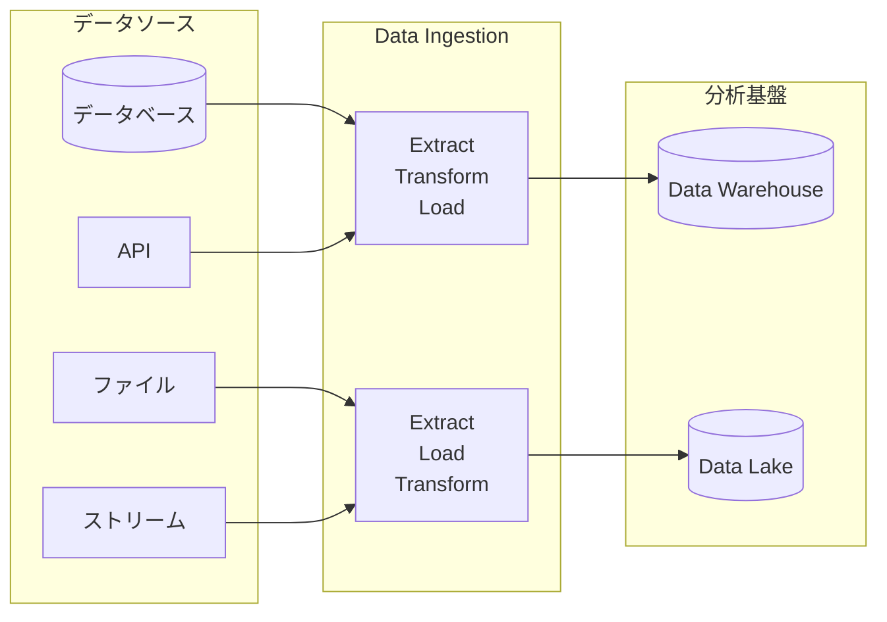

# Data Ingestion とは？

<h3 class="font-semibold text-blue-800">定義</h3>

様々なデータソースから分析用データベースやデータウェアハウスにデータを取り込むプロセス

<h3 class="font-semibold text-green-800">目的</h3>

分析、レポーティング、機械学習のためにデータを利用可能な形で集約

::right::

