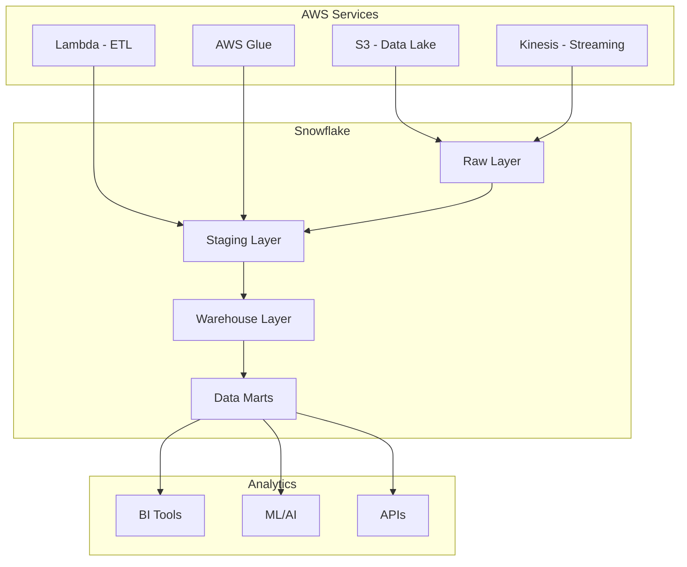

---
# You can also start simply with 'default'
theme: seriph
# random image from a curated Unsplash collection by Anthony
# like them? see https://unsplash.com/collections/94734566/slidev
background: https://images.unsplash.com/flagged/photo-1576781052958-061cf393473a?q=80&w=1760&auto=format&fit=crop&ixlib=rb-4.1.0&ixid=M3wxMjA3fDB8MHxwaG90by1wYWdlfHx8fGVufDB8fHx8fA%3D%3D&w=2834&q=80
title: Snowflake と AWS で始めるデータエンジニアリング
info: |
  ## データエンジニアリング with Snowflake & AWS
  現代的なクラウドデータプラットフォームの構築手法
# apply unocss classes to the current slide
class: text-center
# https://sli.dev/features/drawing
drawings:
  persist: false
# slide transition: https://sli.dev/guide/animations.html#slide-transitions
transition: slide-left
# enable MDC Syntax: https://sli.dev/features/mdc
mdc: true
# open graph
seoMeta:
  # By default, Slidev will use ./og-image.png if it exists,
  # or generate one from the first slide if not found.
  ogImage: auto
  # ogImage: https://cover.sli.dev
# router base for GitHub Pages deployment
routerMode: hash
---

# Snowflake と AWS で<br>データ基盤構築

現代的なクラウドデータプラットフォームの構築手法

<div class="pt-12">
  <span @click="$slidev.nav.next" class="px-2 py-1 rounded cursor-pointer" hover="bg-white bg-opacity-10">
    スライドを開始 <carbon:arrow-right class="inline"/>
  </span>
</div>

<div class="abs-br m-6 flex gap-2">
  <button @click="$slidev.nav.openInEditor()" title="Open in Editor" class="text-xl slidev-icon-btn opacity-50 !border-none !hover:text-white">
    <carbon:edit />
  </button>
  <a href="https://github.com/slidevjs/slidev" target="_blank" alt="GitHub" title="Open in GitHub"
    class="text-xl slidev-icon-btn opacity-50 !border-none !hover:text-white">
    <carbon:logo-github />
  </a>
</div>

---

src: ./pages/table-of-contents.md
hide: false

---

---

# なぜ Snowflake + AWS なのか？

<div grid="~ cols-2 gap-4">
<div>

## Snowflake の強み

- 🏗️ **ゼロ管理アーキテクチャ**
- ⚡ **自動スケーリング**
- 🔄 **データシェアリング機能**
- 📊 **SQL ベースの操作**
- 🌐 **マルチクラウド対応**

</div>
<div>

## AWS の強み

- 🛠️ **豊富なデータサービス**
- 🔒 **セキュリティ & コンプライアンス**
- 💰 **コスト最適化**
- 🌍 **グローバルインフラ**
- 🤖 **AI/ML サービスとの統合**

</div>
</div>

<div v-click class="mt-8 p-4 bg-blue-50 rounded-lg">
<span class="text-blue-600 font-semibold">結果:</span> スケーラブルで管理しやすい現代的なデータプラットフォーム
</div>

---

layout: two-cols
layoutClass: gap-16

---

# データ基盤アーキテクチャ概要

<div class="text-sm">

## データレイヤー構成

- **Raw Layer** - 生データの格納
- **Staging Layer** - データ変換・加工
- **Warehouse Layer** - 分析用データマート
- **Presentation Layer** - BI・レポート層

</div>

::right::



---

# AWS サービスとの連携

<div grid="~ cols-3 gap-4 mt-4">

<div class="border border-gray-200 rounded-lg p-4">
<h3 class="text-lg font-semibold mb-3 flex items-center">
  <carbon:cloud-upload class="mr-2"/> データ取り込み
</h3>

- **S3** - データレイク
- **Kinesis** - ストリーミング
- **DMS** - データベース移行
- **Lambda** - リアルタイム処理

</div>

<div class="border border-gray-200 rounded-lg p-4">
<h3 class="text-lg font-semibold mb-3 flex items-center">
  <carbon:data-processing class="mr-2"/> データ処理
</h3>

- **Glue** - ETL ジョブ
- **EMR** - ビッグデータ処理
- **Step Functions** - ワークフロー
- **EventBridge** - イベント管理

</div>

<div class="border border-gray-200 rounded-lg p-4">
<h3 class="text-lg font-semibold mb-3 flex items-center">
  <carbon:security class="mr-2"/> セキュリティ
</h3>

- **IAM** - アクセス制御
- **KMS** - 暗号化
- **CloudTrail** - 監査ログ
- **VPC** - ネットワーク分離

</div>

</div>

<div v-click class="mt-6 p-4 bg-yellow-50 rounded-lg">
<carbon:idea class="inline mr-2 text-yellow-600"/>
<span class="text-yellow-800">ポイント: AWS の既存サービスを活用して Snowflake との連携を最適化</span>
</div>

---

# データパイプライン構築手順

<div class="grid grid-cols-1 gap-4 mt-4">

<div v-click="1" class="flex items-center p-4 border-l-4 border-blue-500 bg-blue-50">
<span class="flex-shrink-0 w-8 h-8 bg-blue-500 text-white rounded-full flex items-center justify-center font-semibold mr-4">1</span>
<div>
  <h3 class="font-semibold">環境セットアップ</h3>
  <p class="text-sm text-gray-600">AWS アカウント設定、Snowflake アカウント作成、ネットワーク構成</p>
</div>
</div>

<div v-click="2" class="flex items-center p-4 border-l-4 border-green-500 bg-green-50">
<span class="flex-shrink-0 w-8 h-8 bg-green-500 text-white rounded-full flex items-center justify-center font-semibold mr-4">2</span>
<div>
  <h3 class="font-semibold">データソース接続</h3>
  <p class="text-sm text-gray-600">S3 ステージング、外部データソースとの連携設定</p>
</div>
</div>

<div v-click="3" class="flex items-center p-4 border-l-4 border-yellow-500 bg-yellow-50">
<span class="flex-shrink-0 w-8 h-8 bg-yellow-500 text-white rounded-full flex items-center justify-center font-semibold mr-4">3</span>
<div>
  <h3 class="font-semibold">ETL パイプライン構築</h3>
  <p class="text-sm text-gray-600">Snowpipe、Streams & Tasks を使用した自動化パイプライン</p>
</div>
</div>

<div v-click="4" class="flex items-center p-4 border-l-4 border-purple-500 bg-purple-50">
<span class="flex-shrink-0 w-8 h-8 bg-purple-500 text-white rounded-full flex items-center justify-center font-semibold mr-4">4</span>
<div>
  <h3 class="font-semibold">監視・運用</h3>
  <p class="text-sm text-gray-600">CloudWatch、Snowflake メタデータを使った監視システム構築</p>
</div>
</div>

</div>

---

# S3 ステージング設定

AWS S3 と Snowflake の連携設定

```sql
-- S3 ステージの作成
CREATE OR REPLACE STAGE my_s3_stage
  URL = 's3://my-data-bucket/data/'
  CREDENTIALS = (
    AWS_KEY_ID = 'YOUR_ACCESS_KEY'
    AWS_SECRET_KEY = 'YOUR_SECRET_KEY'
  )
  FILE_FORMAT = (TYPE = 'CSV' FIELD_DELIMITER = ',' SKIP_HEADER = 1);

-- ステージのテスト
LIST @my_s3_stage;

-- データの確認
SELECT $1, $2, $3 FROM @my_s3_stage/sample_data.csv LIMIT 10;
```

<div v-click class="mt-4 p-4 bg-blue-50 rounded-lg">
<carbon:security class="inline mr-2 text-blue-600"/>
<span class="text-blue-800">セキュリティ: IAM ロールベースの認証を推奨（AWS_ROLE 使用）</span>
</div>

---

# Snowpipe による自動データ取り込み

リアルタイムデータ取り込みの自動化

```sql
-- Snowpipe の作成
CREATE OR REPLACE PIPE my_data_pipe
  AUTO_INGEST = TRUE
  AS
  COPY INTO target_table
  FROM @my_s3_stage
  FILE_FORMAT = (TYPE = 'JSON');

-- Snowpipe の状態確認
SHOW PIPES;

-- 取り込み履歴の確認
SELECT * FROM TABLE(INFORMATION_SCHEMA.COPY_HISTORY(
  TABLE_NAME => 'TARGET_TABLE',
  START_TIME => DATEADD(hours, -24, CURRENT_TIMESTAMP())
));
```

<div class="mt-4">
<div v-click="1" class="p-3 bg-green-50 border-l-4 border-green-500 mb-2">
<strong>メリット:</strong> S3 へのファイル配置で自動的にデータが取り込まれる
</div>
<div v-click="2" class="p-3 bg-yellow-50 border-l-4 border-yellow-500">
<strong>注意:</strong> SQS 通知の設定が必要（AUTO_INGEST = TRUE の場合）
</div>
</div>

---

# Streams & Tasks によるデータ変換

変更データキャプチャとスケジュール処理

````md magic-move {lines: true}
```sql
-- Stream の作成（変更データキャプチャ）
CREATE OR REPLACE STREAM raw_data_stream
  ON TABLE raw_data_table;

-- Stream の確認
SELECT * FROM raw_data_stream LIMIT 10;
```

```sql
-- 変換処理用 Task の作成
CREATE OR REPLACE TASK transform_task
  WAREHOUSE = 'COMPUTE_WH'
  SCHEDULE = 'USING CRON 0 */1 * * * UTC'  -- 1時間ごと
  WHEN SYSTEM$STREAM_HAS_DATA('RAW_DATA_STREAM')
  AS
  INSERT INTO processed_table
  SELECT
    id,
    UPPER(name) as name,
    created_date,
    METADATA$ACTION as dml_action
  FROM raw_data_stream
  WHERE METADATA$ACTION != 'DELETE';
```

```sql
-- Task の開始
ALTER TASK transform_task RESUME;

-- Task の実行履歴確認
SELECT * FROM TABLE(INFORMATION_SCHEMA.TASK_HISTORY(
  TASK_NAME => 'TRANSFORM_TASK',
  SCHEDULED_TIME_RANGE_START => DATEADD(hour, -24, CURRENT_TIMESTAMP())
));
```
````

---

layout: two-cols
layoutClass: gap-8

---

# AWS Lambda との連携

<div class="text-sm">

## Python でのデータ処理例

```python
import json
import boto3
import snowflake.connector

def lambda_handler(event, context):
    # S3 イベントの処理
    bucket = event['Records'][0]['s3']['bucket']['name']
    key = event['Records'][0]['s3']['object']['key']

    # Snowflake 接続
    conn = snowflake.connector.connect(
        user='your_user',
        password='your_password',
        account='your_account',
        warehouse='COMPUTE_WH',
        database='ANALYTICS_DB',
        schema='PUBLIC'
    )

    # データ処理実行
    cursor = conn.cursor()
    cursor.execute(f"""
        COPY INTO raw_table
        FROM 's3://{bucket}/{key}'
        FILE_FORMAT = (TYPE = 'JSON')
    """)

    return {
        'statusCode': 200,
        'body': json.dumps('Data processed successfully')
    }
```

</div>

::right::

<div class="text-sm mt-8">

## 使用場面

<div v-click="1" class="mb-4">
<h4 class="font-semibold text-green-600">✅ 適用場面</h4>
<ul class="list-disc ml-4 space-y-1">
<li>軽量なデータ変換</li>
<li>外部 API からのデータ取得</li>
<li>データ品質チェック</li>
<li>アラート・通知処理</li>
</ul>
</div>

<div v-click="2">
<h4 class="font-semibold text-red-600">❌ 避けるべき場面</h4>
<ul class="list-disc ml-4 space-y-1">
<li>大量データの複雑な変換</li>
<li>長時間実行される処理</li>
<li>メモリ集約的な処理</li>
</ul>
</div>

</div>

---

# データ品質管理

<div class="grid grid-cols-2 gap-6">

<div>
<h3 class="text-lg font-semibold mb-3">品質チェックの実装</h3>

```sql
-- データ品質チェック用ビュー
CREATE OR REPLACE VIEW data_quality_metrics AS
SELECT
  TABLE_NAME,
  COUNT(*) as total_rows,
  COUNT(DISTINCT id) as unique_ids,
  SUM(CASE WHEN name IS NULL THEN 1 ELSE 0 END) as null_names,
  SUM(CASE WHEN email LIKE '%@%' THEN 0 ELSE 1 END) as invalid_emails,
  CURRENT_TIMESTAMP as check_timestamp
FROM information_schema.tables t
LEFT JOIN my_table mt ON 1=1
GROUP BY TABLE_NAME;

-- 品質アラートタスク
CREATE OR REPLACE TASK quality_check_task
  WAREHOUSE = 'COMPUTE_WH'
  SCHEDULE = 'USING CRON 0 9 * * * UTC'
  AS
  INSERT INTO quality_alerts
  SELECT * FROM data_quality_metrics
  WHERE null_names > 100 OR invalid_emails > 50;
```

</div>

<div>
<h3 class="text-lg font-semibold mb-3">監視ダッシュボード</h3>

<div class="space-y-2">
<div v-click="1" class="p-3 border rounded bg-green-50">
<strong>データ取り込み量:</strong> 日次・時間別トレンド
</div>
<div v-click="2" class="p-3 border rounded bg-blue-50">
<strong>品質スコア:</strong> 完全性・正確性メトリクス
</div>
<div v-click="3" class="p-3 border rounded bg-yellow-50">
<strong>パフォーマンス:</strong> クエリ実行時間・コスト
</div>
<div v-click="4" class="p-3 border rounded bg-purple-50">
<strong>利用状況:</strong> ユーザー別・テーブル別アクセス
</div>
</div>

</div>

</div>

---

# コスト最適化戦略

<div class="grid grid-cols-3 gap-4 mt-4">

<div class="border border-gray-200 rounded-lg p-4">
<h3 class="font-semibold text-blue-600 mb-3">
  <carbon:money class="inline mr-2"/>Snowflake コスト
</h3>

<div class="space-y-2 text-sm">
<div v-click="1">• **ウェアハウスの自動停止**</div>
<div v-click="2">• **適切なサイズ選択**</div>
<div v-click="3">• **クラスタリングキー最適化**</div>
<div v-click="4">• **結果キャッシュ活用**</div>
</div>

</div>

<div class="border border-gray-200 rounded-lg p-4">
<h3 class="font-semibold text-green-600 mb-3">
  <carbon:cloud class="inline mr-2"/>AWS コスト
</h3>

<div class="space-y-2 text-sm">
<div v-click="1">• **S3 ライフサイクル管理**</div>
<div v-click="2">• **Lambda 実行時間最適化**</div>
<div v-click="3">• **適切なインスタンス選択**</div>
<div v-click="4">• **予約インスタンス活用**</div>
</div>

</div>

<div class="border border-gray-200 rounded-lg p-4">
<h3 class="font-semibold text-purple-600 mb-3">
  <carbon:analytics class="inline mr-2"/>監視・分析
</h3>

<div class="space-y-2 text-sm">
<div v-click="1">• **コスト配分タグ**</div>
<div v-click="2">• **使用量アラート**</div>
<div v-click="3">• **定期レポート作成**</div>
<div v-click="4">• **ROI 分析**</div>
</div>

</div>

</div>

<div v-click="5" class="mt-6 p-4 bg-gray-50 rounded-lg">
<strong>コスト最適化の例:</strong> 開発環境では小さなウェアハウス、本番環境では自動スケーリング設定
</div>

---

# セキュリティのベストプラクティス

<div class="grid grid-cols-2 gap-6">

<div>
<h3 class="text-lg font-semibold mb-4 flex items-center">
  <carbon:security class="mr-2 text-red-600"/>アクセス制御
</h3>

```sql
-- ロールベースアクセス制御
CREATE OR REPLACE ROLE data_analyst;
CREATE OR REPLACE ROLE data_engineer;

-- 権限の付与
GRANT SELECT ON DATABASE analytics_db TO ROLE data_analyst;
GRANT ALL ON SCHEMA analytics_db.staging TO ROLE data_engineer;

-- ユーザーへのロール割り当て
GRANT ROLE data_analyst TO USER john_doe;

-- 行レベルセキュリティ
CREATE OR REPLACE ROW ACCESS POLICY department_policy
AS (department = CURRENT_USER())
APPLIES TO (employee_table);
```

</div>

<div>
<h3 class="text-lg font-semibold mb-4 flex items-center">
  <carbon:locked class="mr-2 text-blue-600"/>暗号化・監査
</h3>

<div class="space-y-3 text-sm">
<div v-click="1" class="p-3 border-l-4 border-blue-500 bg-blue-50">
<strong>転送時暗号化:</strong> TLS/SSL 通信
</div>
<div v-click="2" class="p-3 border-l-4 border-green-500 bg-green-50">
<strong>保存時暗号化:</strong> AWS KMS キー使用
</div>
<div v-click="3" class="p-3 border-l-4 border-yellow-500 bg-yellow-50">
<strong>ネットワーク分離:</strong> Private Link 使用
</div>
<div v-click="4" class="p-3 border-l-4 border-purple-500 bg-purple-50">
<strong>監査ログ:</strong> CloudTrail + Snowflake ログ
</div>
</div>

</div>

</div>

<div v-click="5" class="mt-6 p-4 bg-red-50 border border-red-200 rounded-lg">
<carbon:warning class="inline mr-2 text-red-600"/>
<strong>重要:</strong> 本番環境では多要素認証とIP制限を必ず設定する
</div>

---

# 運用監視の仕組み

<div class="grid grid-cols-1 gap-4">

<div class="border border-gray-200 rounded-lg p-4">
<h3 class="font-semibold mb-3 flex items-center">
  <carbon:dashboard class="mr-2 text-blue-600"/>パフォーマンス監視
</h3>

```sql
-- クエリパフォーマンス分析
SELECT
  query_text,
  warehouse_name,
  execution_time,
  queued_provisioning_time,
  total_elapsed_time
FROM snowflake.account_usage.query_history
WHERE start_time >= DATEADD(day, -7, CURRENT_TIMESTAMP())
ORDER BY total_elapsed_time DESC
LIMIT 20;
```

</div>

<div class="border border-gray-200 rounded-lg p-4">
<h3 class="font-semibold mb-3 flex items-center">
  <carbon:cloud-monitoring class="mr-2 text-green-600"/>CloudWatch 統合
</h3>

<div class="text-sm space-y-2">
<div v-click="1">• **カスタムメトリクス:** データ取り込み量、エラー率</div>
<div v-click="2">• **アラート設定:** 閾値ベースの通知</div>
<div v-click="3">• **ダッシュボード:** リアルタイム監視</div>
</div>

</div>

</div>

---

layout: two-cols
layoutClass: gap-8

---

# 実装チェックリスト

<div class="text-sm">

## 🚀 初期セットアップ

<div class="space-y-1">
<div v-click="1">☐ AWS アカウント・権限設定</div>
<div v-click="2">☐ Snowflake アカウント作成</div>
<div v-click="3">☐ ネットワーク構成（VPC, セキュリティグループ）</div>
<div v-click="4">☐ S3 バケット・IAM ロール作成</div>
</div>

## 📊 データパイプライン

<div class="space-y-1">
<div v-click="5">☐ ステージング設定</div>
<div v-click="6">☐ Snowpipe 構成</div>
<div v-click="7">☐ ETL プロセス実装</div>
<div v-click="8">☐ データ品質チェック</div>
</div>

</div>

::right::

<div class="text-sm">

## 🔒 セキュリティ

<div class="space-y-1">
<div v-click="9">☐ 暗号化設定（転送・保存時）</div>
<div v-click="10">☐ ロールベースアクセス制御</div>
<div v-click="11">☐ 監査ログ設定</div>
<div v-click="12">☐ ネットワークセキュリティ</div>
</div>

## 📈 運用・監視

<div class="space-y-1">
<div v-click="13">☐ パフォーマンス監視</div>
<div v-click="14">☐ アラート設定</div>
<div v-click="15">☐ バックアップ・災害復旧</div>
<div v-click="16">☐ コスト監視・最適化</div>
</div>

</div>

---

# トラブルシューティング

<div class="grid grid-cols-2 gap-6">

<div>
<h3 class="text-lg font-semibold mb-3 text-red-600">よくある問題と対処法</h3>

<div class="space-y-3 text-sm">
<div class="p-3 border border-red-200 rounded bg-red-50">
<strong>Snowpipe が動作しない</strong><br>
→ SQS 通知設定、IAM 権限を確認
</div>
<div class="p-3 border border-yellow-200 rounded bg-yellow-50">
<strong>クエリが遅い</strong><br>
→ ウェアハウスサイズ、クラスタリングキーを見直し
</div>
<div class="p-3 border border-blue-200 rounded bg-blue-50">
<strong>データ形式エラー</strong><br>
→ FILE_FORMAT パラメータを調整
</div>
</div>

</div>

<div>
<h3 class="text-lg font-semibold mb-3 text-green-600">診断クエリ</h3>

```sql
-- エラーログの確認
SELECT * FROM TABLE(VALIDATE(
  @my_s3_stage,
  JOB_ID => '_last'
));

-- ウェアハウス使用状況
SELECT
  warehouse_name,
  AVG(avg_running) as avg_queries,
  SUM(credits_used) as total_credits
FROM snowflake.account_usage.warehouse_load_history
WHERE start_time >= DATEADD(day, -7, CURRENT_TIMESTAMP())
GROUP BY warehouse_name;
```

</div>

</div>

---

# 次のステップ

<div class="grid grid-cols-3 gap-4 mt-6">

<div class="text-center p-6 border border-gray-200 rounded-lg">
<div class="text-4xl mb-4">🤖</div>
<h3 class="font-semibold mb-2">AI/ML 統合</h3>
<p class="text-sm text-gray-600">SageMaker、Snowflake ML との連携</p>
</div>

<div class="text-center p-6 border border-gray-200 rounded-lg">
<div class="text-4xl mb-4">🔄</div>
<h3 class="font-semibold mb-2">リアルタイム処理</h3>
<p class="text-sm text-gray-600">Kinesis、Snowflake Streams 活用</p>
</div>

<div class="text-center p-6 border border-gray-200 rounded-lg">
<div class="text-4xl mb-4">🌐</div>
<h3 class="font-semibold mb-2">マルチクラウド</h3>
<p class="text-sm text-gray-600">Azure、GCP との連携拡張</p>
</div>

</div>

<div v-click class="mt-8 p-6 bg-gradient-to-r from-blue-50 to-green-50 rounded-lg border">
<h3 class="font-semibold text-lg mb-2 flex items-center">
<carbon:rocket class="mr-2"/>データ基盤の継続的改善
</h3>
<p class="text-gray-700">構築後も定期的な最適化、新機能の導入、セキュリティ更新を継続することが重要です。</p>
</div>

---

layout: center
class: text-center

---

# まとめ

Snowflake と AWS を組み合わせることで<br>
**スケーラブル**で**管理しやすい**現代的なデータプラットフォームを構築可能

<div class="grid grid-cols-2 gap-8 mt-8 text-left">

<div>
<h3 class="font-semibold mb-3 text-blue-600">✅ 実現できること</h3>
<ul class="space-y-2 text-sm">
<li>• 自動スケーリング</li>
<li>• リアルタイムデータ処理</li>
<li>• 高いセキュリティ</li>
<li>• コスト最適化</li>
</ul>
</div>

<div>
<h3 class="font-semibold mb-3 text-green-600">🎯 重要ポイント</h3>
<ul class="space-y-2 text-sm">
<li>• セキュリティファースト</li>
<li>• 段階的な構築</li>
<li>• 継続的な監視・最適化</li>
<li>• データ品質管理</li>
</ul>
</div>

</div>

<div class="mt-8">
<span class="px-4 py-2 bg-blue-500 text-white rounded-lg">
質問・ディスカッションタイム
</span>
</div>

<PoweredBySlidev mt-10 />
