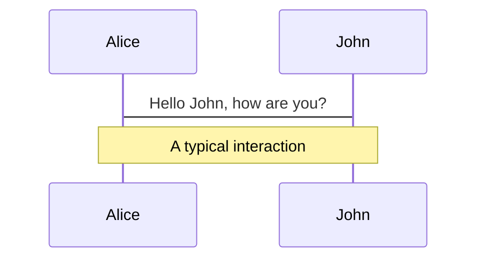
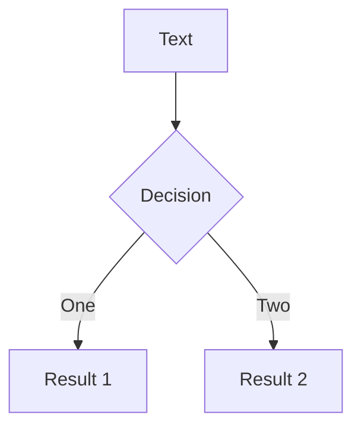
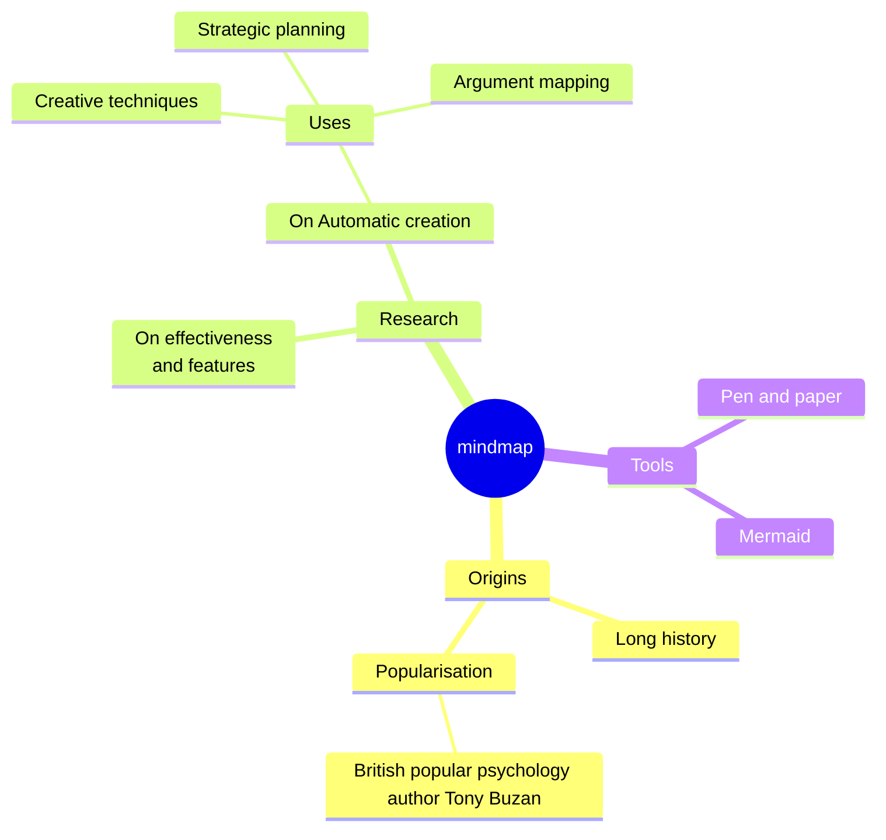
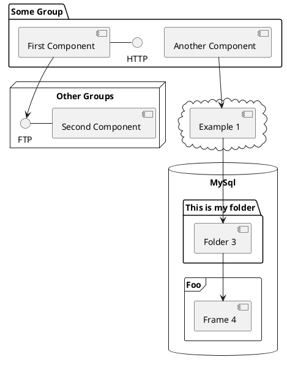
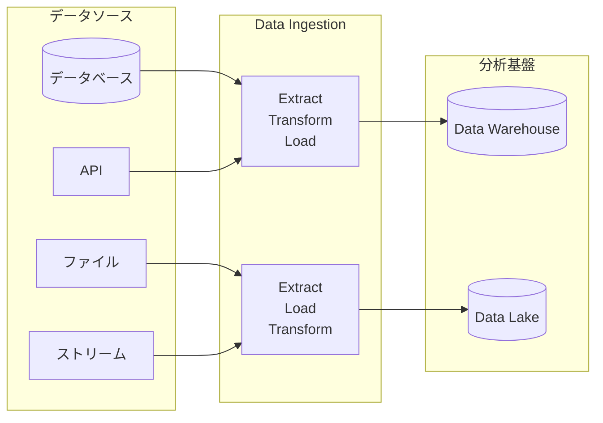
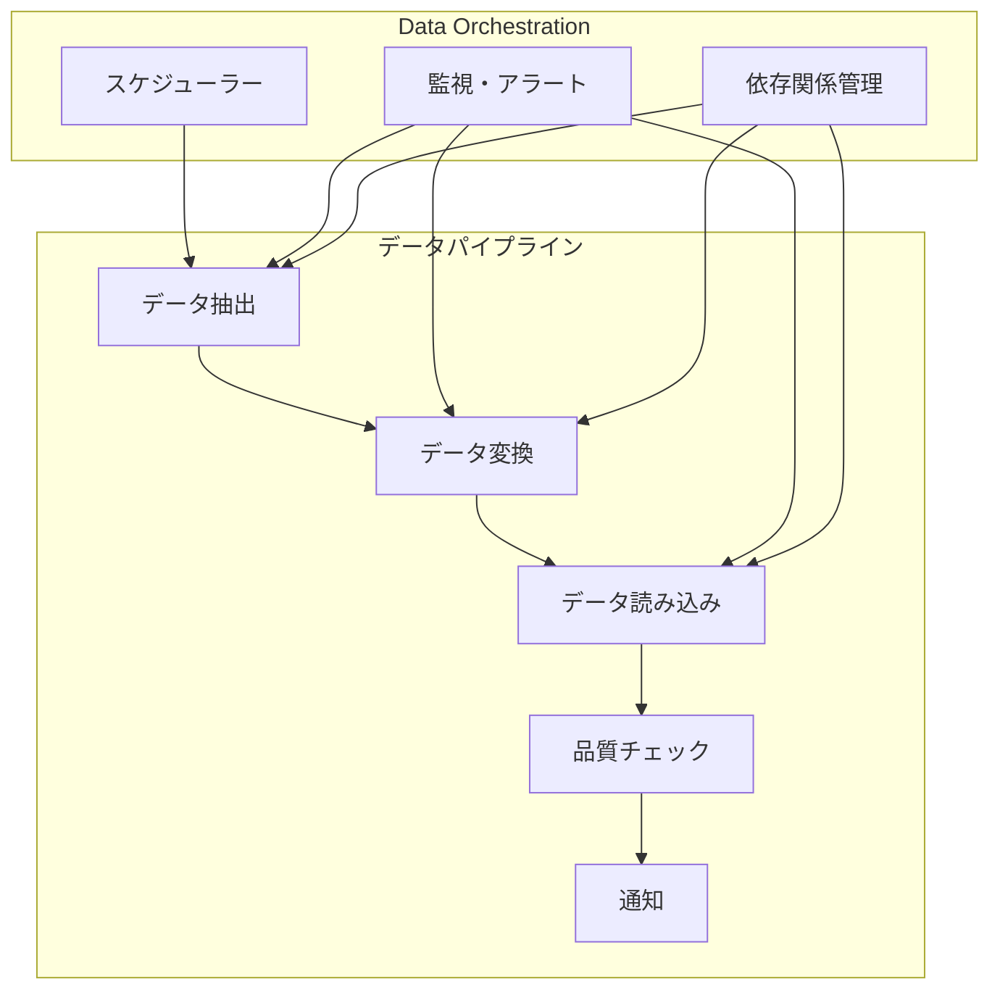

# Welcome to Slidev

Presentation slides for developers

<div @click="$slidev.nav.next" class="mt-12 py-1" hover:bg="white op-10">
  Press Space for next page <carbon:arrow-right />
</div>

<div class="abs-br m-6 text-xl">
  <button @click="$slidev.nav.openInEditor()" title="Open in Editor" class="slidev-icon-btn">
    <carbon:edit />
  </button>
  <a href="https://github.com/slidevjs/slidev" target="_blank" class="slidev-icon-btn">
    <carbon:logo-github />
  </a>
</div>

<!--
The last comment block of each slide will be treated as slide notes. It will be visible and editable in Presenter Mode along with the slide. [Read more in the docs](https://sli.dev/guide/syntax.html#notes)
-->

---

## transition: fade-out

# What is Slidev?

Slidev is a slides maker and presenter designed for developers, consist of the following features

- 📝 **Text-based** - focus on the content with Markdown, and then style them later
- 🎨 **Themable** - themes can be shared and re-used as npm packages
- 🧑‍💻 **Developer Friendly** - code highlighting, live coding with autocompletion
- 🤹 **Interactive** - embed Vue components to enhance your expressions
- 🎥 **Recording** - built-in recording and camera view
- 📤 **Portable** - export to PDF, PPTX, PNGs, or even a hostable SPA
- 🛠 **Hackable** - virtually anything that's possible on a webpage is possible in Slidev
  <br>
  <br>

Read more about [Why Slidev?](https://sli.dev/guide/why)

<!--
You can have `style` tag in markdown to override the style for the current page.
Learn more: https://sli.dev/features/slide-scope-style
-->

<style>
h1 {
  background-color: #2B90B6;
  background-image: linear-gradient(45deg, #4EC5D4 10%, #146b8c 20%);
  background-size: 100%;
  -webkit-background-clip: text;
  -moz-background-clip: text;
  -webkit-text-fill-color: transparent;
  -moz-text-fill-color: transparent;
}
</style>

<!--
Here is another comment.
-->

---

transition: slide-down
level: 2

---

# Navigation

Hover on the bottom-left corner to see the navigation's controls panel, [learn more](https://sli.dev/guide/ui#navigation-bar)

## Keyboard Shortcuts

|                                                    |                             |
| -------------------------------------------------- | --------------------------- |
| <kbd>right</kbd> / <kbd>space</kbd>                | next animation or slide     |
| <kbd>left</kbd> / <kbd>shift</kbd><kbd>space</kbd> | previous animation or slide |
| <kbd>up</kbd>                                      | previous slide              |
| <kbd>down</kbd>                                    | next slide                  |

<!-- https://sli.dev/guide/animations.html#click-animation -->


<p v-after class="absolute bottom-23 left-45 opacity-30 transform -rotate-10">Here!</p>

---

layout: two-cols
layoutClass: gap-16

---

# Table of contents

You can use the `Toc` component to generate a table of contents for your slides:

```html
<Toc minDepth="1" maxDepth="1" />
```

The title will be inferred from your slide content, or you can override it with `title` and `level` in your frontmatter.

::right::

<Toc text-sm minDepth="1" maxDepth="2" />

---

layout: image-right
image: https://cover.sli.dev

---

# Code

Use code snippets and get the highlighting directly, and even types hover!

```ts [filename-example.ts] {all|4|6|6-7|9|all} twoslash
// TwoSlash enables TypeScript hover information
// and errors in markdown code blocks
// More at https://shiki.style/packages/twoslash
import { computed, ref } from "vue";

const count = ref(0);
const doubled = computed(() => count.value * 2);

doubled.value = 2;
```

<arrow v-click="[4, 5]" x1="350" y1="310" x2="195" y2="342" color="#953" width="2" arrowSize="1" />

<!-- This allow you to embed external code blocks -->

<<< @/snippets/external.ts#snippet

<!-- Footer -->

[Learn more](https://sli.dev/features/line-highlighting)

<!-- Inline style -->
<style>
.footnotes-sep {
  @apply mt-5 opacity-10;
}
.footnotes {
  @apply text-sm opacity-75;
}
.footnote-backref {
  display: none;
}
</style>

<!--
Notes can also sync with clicks

[click] This will be highlighted after the first click

[click] Highlighted with `count = ref(0)`

[click:3] Last click (skip two clicks)
-->

---

## level: 2

# Shiki Magic Move

Powered by [shiki-magic-move](https://shiki-magic-move.netlify.app/), Slidev supports animations across multiple code snippets.

Add multiple code blocks and wrap them with <code>````md magic-move</code> (four backticks) to enable the magic move. For example:

````md magic-move {lines: true}
```ts {*|2|*}
// step 1
const author = reactive({
  name: "John Doe",
  books: [
    "Vue 2 - Advanced Guide",
    "Vue 3 - Basic Guide",
    "Vue 4 - The Mystery",
  ],
});
```

```ts {*|1-2|3-4|3-4,8}
// step 2
export default {
  data() {
    return {
      author: {
        name: "John Doe",
        books: [
          "Vue 2 - Advanced Guide",
          "Vue 3 - Basic Guide",
          "Vue 4 - The Mystery",
        ],
      },
    };
  },
};
```

```ts
// step 3
export default {
  data: () => ({
    author: {
      name: "John Doe",
      books: [
        "Vue 2 - Advanced Guide",
        "Vue 3 - Basic Guide",
        "Vue 4 - The Mystery",
      ],
    },
  }),
};
```

Non-code blocks are ignored.

```vue
<!-- step 4 -->
<script setup>
const author = {
  name: "John Doe",
  books: [
    "Vue 2 - Advanced Guide",
    "Vue 3 - Basic Guide",
    "Vue 4 - The Mystery",
  ],
};
</script>
```
````

---

# Components

<div grid="~ cols-2 gap-4">
<div>

You can use Vue components directly inside your slides.

We have provided a few built-in components like `<Tweet/>` and `<Youtube/>` that you can use directly. And adding your custom components is also super easy.

Check out [the guides](https://sli.dev/builtin/components.html) for more.

</div>
<div>

```html
<Tweet id="1390115482657726468" />
```

<Tweet id="1390115482657726468" scale="0.65" />

</div>
</div>

<!--
Presenter note with **bold**, *italic*, and ~~striked~~ text.

Also, HTML elements are valid:
<div class="flex w-full">
  <span style="flex-grow: 1;">Left content</span>
  <span>Right content</span>
</div>
-->

---

## class: px-20

# Themes

Slidev comes with powerful theming support. Themes can provide styles, layouts, components, or even configurations for tools. Switching between themes by just **one edit** in your frontmatter:

<div grid="~ cols-2 gap-2" m="t-2">

```yaml
---
theme: default
---
```

```yaml
---
theme: seriph
---
```


</div>

Read more about [How to use a theme](https://sli.dev/guide/theme-addon#use-theme) and
check out the [Awesome Themes Gallery](https://sli.dev/resources/theme-gallery).

---

# Clicks Animations

You can add `v-click` to elements to add a click animation.

<div v-click>

This shows up when you click the slide:

```html
<div v-click>This shows up when you click the slide.</div>
```

</div>

<br>

<v-click>

The <span v-mark.red="3"><code>v-mark</code> directive</span>
also allows you to add
<span v-mark.circle.orange="4">inline marks</span>
, powered by [Rough Notation](https://roughnotation.com/):

```html
<span v-mark.underline.orange>inline markers</span>
```

</v-click>

<div mt-20 v-click>

[Learn more](https://sli.dev/guide/animations#click-animation)

</div>

---

# Motions

Motion animations are powered by [@vueuse/motion](https://motion.vueuse.org/), triggered by `v-motion` directive.

```html
<div
  v-motion
  :initial="{ x: -80 }"
  :enter="{ x: 0 }"
  :click-3="{ x: 80 }"
  :leave="{ x: 1000 }"
>
  Slidev
</div>
```

<div class="w-60 relative">
  <div class="relative w-40 h-40">
    
    
    
  </div>

  <div
    class="text-5xl absolute top-14 left-40 text-[#2B90B6] -z-1"
    v-motion
    :initial="{ x: -80, opacity: 0}"
    :enter="{ x: 0, opacity: 1, transition: { delay: 2000, duration: 1000 } }">
    Slidev
  </div>
</div>

<!-- vue script setup scripts can be directly used in markdown, and will only affects current page -->
<script setup lang="ts">
const final = {
  x: 0,
  y: 0,
  rotate: 0,
  scale: 1,
  transition: {
    type: 'spring',
    damping: 10,
    stiffness: 20,
    mass: 2
  }
}
</script>

<div
  v-motion
  :initial="{ x:35, y: 30, opacity: 0}"
  :enter="{ y: 0, opacity: 1, transition: { delay: 3500 } }">

[Learn more](https://sli.dev/guide/animations.html#motion)

</div>

---

# LaTeX

LaTeX is supported out-of-box. Powered by [KaTeX](https://katex.org/).

<div h-3 />

Inline $\sqrt{3x-1}+(1+x)^2$

Block

$$
{1|3|all}
\begin{aligned}
\nabla \cdot \vec{E} &= \frac{\rho}{\varepsilon_0} \\
\nabla \cdot \vec{B} &= 0 \\
\nabla \times \vec{E} &= -\frac{\partial\vec{B}}{\partial t} \\
\nabla \times \vec{B} &= \mu_0\vec{J} + \mu_0\varepsilon_0\frac{\partial\vec{E}}{\partial t}
\end{aligned}
$$

[Learn more](https://sli.dev/features/latex)

---

# Diagrams

You can create diagrams / graphs from textual descriptions, directly in your Markdown.

<div class="grid grid-cols-4 gap-5 pt-4 -mb-6">









</div>

Learn more: [Mermaid Diagrams](https://sli.dev/features/mermaid) and [PlantUML Diagrams](https://sli.dev/features/plantuml)

---

foo: bar
dragPos:
square: 691,32,167,\_,-16

---

dragPos:
square: 0,-8,0,0

---
dragPos:
  square: 0,-8,0,0
---

# Draggable Elements

Double-click on the draggable elements to edit their positions.

<br>

###### Directive Usage

```md

```

<br>

###### Component Usage

```md
<v-drag text-3xl>
  <div class="i-carbon:arrow-up" />
  Use the `v-drag` component to have a draggable container!
</v-drag>
```

<v-drag pos="380,237,261,_,-15">
  <div text-center text-3xl border border-main rounded>
    Double-click me!
  </div>
</v-drag>


###### Draggable Arrow

```md
<v-drag-arrow two-way />
```

<v-drag-arrow pos="67,452,253,46" two-way op70 />

---

# Imported Slides

You can split your slides.md into multiple files and organize them as you want using the `src` attribute.

#### `slides.md`

```markdown
# Page 1

Page 2 from main entry.

---

## src: ./subpage.md
```

<br>

#### `subpage.md`

```markdown
# Page 2

Page 2 from another file.
```

[Learn more](https://sli.dev/guide/syntax.html#importing-slides)

---

# Data Ingestion 概要

データをシステムに取り込むプロセスの全体像

---

layout: two-cols
layoutClass: gap-8

---

# Data Ingestion とは？

<div class="space-y-4">

<div v-click="1" class="p-4 bg-blue-50 rounded-lg border-l-4 border-blue-500">
<h3 class="font-semibold text-blue-800">定義</h3>
<p class="text-blue-700">様々なデータソースから分析用データベースやデータウェアハウスにデータを取り込むプロセス</p>
</div>

<div v-click="2" class="p-4 bg-green-50 rounded-lg border-l-4 border-green-500">
<h3 class="font-semibold text-green-800">目的</h3>
<p class="text-green-700">分析、レポーティング、機械学習のためにデータを利用可能な形で集約</p>
</div>

</div>

::right::

<div v-click="3" class="mt-8">



</div>

---

# データ取り込みの3つのパターン

<div class="grid grid-cols-1 gap-6 mt-6">

<div v-click="1" class="flex items-center p-4 border-l-4 border-blue-500 bg-blue-50">
<div class="flex-shrink-0 w-12 h-12 bg-blue-500 text-white rounded-full flex items-center justify-center font-bold mr-4">1</div>
<div>
  <h3 class="font-semibold text-blue-800">バッチ処理（Batch Processing）</h3>
  <p class="text-blue-600 text-sm mt-1">定期的にまとまったデータを処理。日次、時間単位など</p>
</div>
</div>

<div v-click="2" class="flex items-center p-4 border-l-4 border-green-500 bg-green-50">
<div class="flex-shrink-0 w-12 h-12 bg-green-500 text-white rounded-full flex items-center justify-center font-bold mr-4">2</div>
<div>
  <h3 class="font-semibold text-green-800">リアルタイム処理（Real-time Processing）</h3>
  <p class="text-green-600 text-sm mt-1">データが生成されるとすぐに処理。ミリ秒～秒単位</p>
</div>
</div>

<div v-click="3" class="flex items-center p-4 border-l-4 border-yellow-500 bg-yellow-50">
<div class="flex-shrink-0 w-12 h-12 bg-yellow-500 text-white rounded-full flex items-center justify-center font-bold mr-4">3</div>
<div>
  <h3 class="font-semibold text-yellow-800">ニアリアルタイム処理（Near Real-time）</h3>
  <p class="text-yellow-600 text-sm mt-1">準リアルタイム。数分～数時間の遅延</p>
</div>
</div>

</div>

---

# ETL vs ELT の違い

<div class="grid grid-cols-2 gap-8 mt-6">

<div v-click="1" class="p-6 bg-gradient-to-br from-blue-50 to-blue-100 rounded-lg">
<h3 class="text-xl font-bold text-blue-800 mb-4">ETL (Extract, Transform, Load)</h3>

<div class="space-y-3">
<div class="flex items-center">
  <div class="w-8 h-8 bg-blue-500 text-white rounded-full flex items-center justify-center text-sm font-bold mr-3">E</div>
  <span>データソースからデータを抽出</span>
</div>
<div class="flex items-center">
  <div class="w-8 h-8 bg-blue-500 text-white rounded-full flex items-center justify-center text-sm font-bold mr-3">T</div>
  <span>外部システムで変換・加工</span>
</div>
<div class="flex items-center">
  <div class="w-8 h-8 bg-blue-500 text-white rounded-full flex items-center justify-center text-sm font-bold mr-3">L</div>
  <span>分析用データベースに読み込み</span>
</div>
</div>

<div class="mt-4 text-sm text-blue-700">
<strong>特徴:</strong> 従来型、データ量が少ない場合に適している
</div>
</div>

<div v-click="2" class="p-6 bg-gradient-to-br from-green-50 to-green-100 rounded-lg">
<h3 class="text-xl font-bold text-green-800 mb-4">ELT (Extract, Load, Transform)</h3>

<div class="space-y-3">
<div class="flex items-center">
  <div class="w-8 h-8 bg-green-500 text-white rounded-full flex items-center justify-center text-sm font-bold mr-3">E</div>
  <span>データソースからデータを抽出</span>
</div>
<div class="flex items-center">
  <div class="w-8 h-8 bg-green-500 text-white rounded-full flex items-center justify-center text-sm font-bold mr-3">L</div>
  <span>生データのまま分析基盤に読み込み</span>
</div>
<div class="flex items-center">
  <div class="w-8 h-8 bg-green-500 text-white rounded-full flex items-center justify-center text-sm font-bold mr-3">T</div>
  <span>分析基盤内で変換・加工</span>
</div>
</div>

<div class="mt-4 text-sm text-green-700">
<strong>特徴:</strong> モダンな手法、大量データ・クラウド環境に適している
</div>
</div>

</div>

---

# データソースの種類

<div class="grid grid-cols-4 gap-4 mt-6">

<div v-click="1" class="text-center p-4 border border-blue-200 rounded-lg bg-blue-50">
<div class="text-4xl mb-2">🗄️</div>
<h3 class="font-semibold text-blue-800">データベース</h3>
<p class="text-xs text-blue-600 mt-2">MySQL, PostgreSQL<br>SQL Server, Oracle</p>
</div>

<div v-click="2" class="text-center p-4 border border-green-200 rounded-lg bg-green-50">
<div class="text-4xl mb-2">📡</div>
<h3 class="font-semibold text-green-800">API</h3>
<p class="text-xs text-green-600 mt-2">REST API<br>GraphQL, webhooks</p>
</div>

<div v-click="3" class="text-center p-4 border border-yellow-200 rounded-lg bg-yellow-50">
<div class="text-4xl mb-2">📄</div>
<h3 class="font-semibold text-yellow-800">ファイル</h3>
<p class="text-xs text-yellow-600 mt-2">CSV, JSON, XML<br>Parquet, Avro</p>
</div>

<div v-click="4" class="text-center p-4 border border-purple-200 rounded-lg bg-purple-50">
<div class="text-4xl mb-2">🌊</div>
<h3 class="font-semibold text-purple-800">ストリーム</h3>
<p class="text-xs text-purple-600 mt-2">Kafka, Kinesis<br>イベント、ログ</p>
</div>

</div>

<div v-click="5" class="mt-8 grid grid-cols-3 gap-4">

<div class="text-center p-4 border border-red-200 rounded-lg bg-red-50">
<div class="text-4xl mb-2">☁️</div>
<h3 class="font-semibold text-red-800">SaaS アプリ</h3>
<p class="text-xs text-red-600 mt-2">Salesforce, HubSpot<br>Google Analytics</p>
</div>

<div class="text-center p-4 border border-indigo-200 rounded-lg bg-indigo-50">
<div class="text-4xl mb-2">📊</div>
<h3 class="font-semibold text-indigo-800">ログ</h3>
<p class="text-xs text-indigo-600 mt-2">アプリケーションログ<br>サーバーログ</p>
</div>

<div class="text-center p-4 border border-pink-200 rounded-lg bg-pink-50">
<div class="text-4xl mb-2">🎯</div>
<h3 class="font-semibold text-pink-800">IoT</h3>
<p class="text-xs text-pink-600 mt-2">センサーデータ<br>デバイス情報</p>
</div>

</div>

---

# Data Ingestion の課題

<div class="space-y-4 mt-6">

<div v-click="1" class="p-4 bg-red-50 border-l-4 border-red-500">
<h3 class="font-semibold text-red-800 flex items-center">
  <span class="mr-2">⚠️</span> データ品質
</h3>
<p class="text-red-700 text-sm mt-1">不正なデータ、欠損値、重複データの処理</p>
</div>

<div v-click="2" class="p-4 bg-yellow-50 border-l-4 border-yellow-500">
<h3 class="font-semibold text-yellow-800 flex items-center">
  <span class="mr-2">📏</span> スケーラビリティ
</h3>
<p class="text-yellow-700 text-sm mt-1">データ量の増加に対応できる仕組みづくり</p>
</div>

<div v-click="3" class="p-4 bg-blue-50 border-l-4 border-blue-500">
<h3 class="font-semibold text-blue-800 flex items-center">
  <span class="mr-2">🔄</span> データフォーマット
</h3>
<p class="text-blue-700 text-sm mt-1">異なる形式のデータを統一した形で処理</p>
</div>

<div v-click="4" class="p-4 bg-purple-50 border-l-4 border-purple-500">
<h3 class="font-semibold text-purple-800 flex items-center">
  <span class="mr-2">⏱️</span> レイテンシ要件
</h3>
<p class="text-purple-700 text-sm mt-1">リアルタイム性とコストのバランス</p>
</div>

<div v-click="5" class="p-4 bg-green-50 border-l-4 border-green-500">
<h3 class="font-semibold text-green-800 flex items-center">
  <span class="mr-2">🛡️</span> セキュリティ・コンプライアンス
</h3>
<p class="text-green-700 text-sm mt-1">個人情報保護、アクセス制御、監査ログ</p>
</div>

</div>

---

# AWS と Snowflake での Data Ingestion

<div class="grid grid-cols-2 gap-8 mt-6">

<div>
<h3 class="text-lg font-semibold text-orange-600 mb-4 flex items-center">
  
  AWS のツール
</h3>

<div class="space-y-3">
<div v-click="1" class="p-3 border border-orange-200 rounded bg-orange-50">
<strong class="text-orange-800">AWS Glue</strong>
<p class="text-sm text-orange-600">サーバーレス ETL サービス</p>
</div>

<div v-click="2" class="p-3 border border-orange-200 rounded bg-orange-50">
<strong class="text-orange-800">Amazon Kinesis</strong>
<p class="text-sm text-orange-600">リアルタイムストリーミング</p>
</div>

<div v-click="3" class="p-3 border border-orange-200 rounded bg-orange-50">
<strong class="text-orange-800">AWS DMS</strong>
<p class="text-sm text-orange-600">データベース移行サービス</p>
</div>

<div v-click="4" class="p-3 border border-orange-200 rounded bg-orange-50">
<strong class="text-orange-800">AWS Lambda</strong>
<p class="text-sm text-orange-600">イベント駆動処理</p>
</div>
</div>

</div>

<div>
<h3 class="text-lg font-semibold text-blue-600 mb-4 flex items-center">
  ❄️ Snowflake のツール
</h3>

<div class="space-y-3">
<div v-click="5" class="p-3 border border-blue-200 rounded bg-blue-50">
<strong class="text-blue-800">Snowpipe</strong>
<p class="text-sm text-blue-600">自動データ取り込み</p>
</div>

<div v-click="6" class="p-3 border border-blue-200 rounded bg-blue-50">
<strong class="text-blue-800">External Tables</strong>
<p class="text-sm text-blue-600">外部データの仮想テーブル</p>
</div>

<div v-click="7" class="p-3 border border-blue-200 rounded bg-blue-50">
<strong class="text-blue-800">Snowflake Connector</strong>
<p class="text-sm text-blue-600">各種システムとの連携</p>
</div>

<div v-click="8" class="p-3 border border-blue-200 rounded bg-blue-50">
<strong class="text-blue-800">Tasks & Streams</strong>
<p class="text-sm text-blue-600">変更データキャプチャ</p>
</div>
</div>

</div>

</div>

---

layout: center
class: text-center

---

# Data Ingestion の成功要因

<div class="grid grid-cols-3 gap-6 mt-8">

<div v-click="1" class="p-6 border border-blue-200 rounded-lg bg-blue-50">
<div class="text-3xl mb-3">🎯</div>
<h3 class="font-semibold text-blue-800">適切な戦略選択</h3>
<p class="text-sm text-blue-600 mt-2">バッチ vs リアルタイム<br>ETL vs ELT</p>
</div>

<div v-click="2" class="p-6 border border-green-200 rounded-lg bg-green-50">
<div class="text-3xl mb-3">🔧</div>
<h3 class="font-semibold text-green-800">適切なツール選択</h3>
<p class="text-sm text-green-600 mt-2">要件に応じた<br>技術スタック</p>
</div>

<div v-click="3" class="p-6 border border-purple-200 rounded-lg bg-purple-50">
<div class="text-3xl mb-3">📊</div>
<h3 class="font-semibold text-purple-800">監視と改善</h3>
<p class="text-sm text-purple-600 mt-2">継続的な<br>パフォーマンス最適化</p>
</div>

</div>

<div v-click="4" class="mt-8 p-4 bg-gradient-to-r from-blue-50 to-green-50 rounded-lg">
<p class="text-gray-700 font-medium">
データ取り込みは分析基盤の基盤。<br>
適切な設計が後続のすべてのプロセスを左右します。
</p>
</div>

---

# Data Orchestration 概要

データパイプラインを統制・管理するワークフロー技術

---

layout: two-cols
layoutClass: gap-8

---

# Data Orchestration とは？

<div class="space-y-4">

<div v-click="1" class="p-4 bg-purple-50 rounded-lg border-l-4 border-purple-500">
<h3 class="font-semibold text-purple-800">定義</h3>
<p class="text-purple-700">データパイプラインの実行順序、スケジュール、依存関係を管理するプロセス</p>
</div>

<div v-click="2" class="p-4 bg-blue-50 rounded-lg border-l-4 border-blue-500">
<h3 class="font-semibold text-blue-800">目的</h3>
<p class="text-blue-700">複雑なデータワークフローを自動化し、効率的で信頼性の高いデータ処理を実現</p>
</div>

<div v-click="3" class="p-4 bg-green-50 rounded-lg border-l-4 border-green-500">
<h3 class="font-semibold text-green-800">価値</h3>
<p class="text-green-700">手動運用からの脱却、エラーハンドリング、スケーラビリティの向上</p>
</div>

</div>

::right::

<div v-click="4" class="mt-4">



</div>

---

# オーケストレーションが解決する課題

<div class="space-y-4 mt-6">

<div v-click="1" class="p-4 bg-red-50 border-l-4 border-red-500">
<h3 class="font-semibold text-red-800 flex items-center">
  <span class="mr-2">🔗</span> 複雑な依存関係
</h3>
<p class="text-red-700 text-sm mt-1">複数のデータソースやプロセス間の実行順序を自動管理</p>
</div>

<div v-click="2" class="p-4 bg-yellow-50 border-l-4 border-yellow-500">
<h3 class="font-semibold text-yellow-800 flex items-center">
  <span class="mr-2">⏰</span> スケジュール管理
</h3>
<p class="text-yellow-700 text-sm mt-1">定期実行、イベント駆動、条件ベースの実行制御</p>
</div>

<div v-click="3" class="p-4 bg-blue-50 border-l-4 border-blue-500">
<h3 class="font-semibold text-blue-800 flex items-center">
  <span class="mr-2">🚨</span> エラーハンドリング
</h3>
<p class="text-blue-700 text-sm mt-1">失敗時の再実行、アラート、ロールバック機能</p>
</div>

<div v-click="4" class="p-4 bg-green-50 border-l-4 border-green-500">
<h3 class="font-semibold text-green-800 flex items-center">
  <span class="mr-2">👁️</span> 監視・可視性
</h3>
<p class="text-green-700 text-sm mt-1">パイプラインの実行状況、パフォーマンスの可視化</p>
</div>

</div>

---

# オーケストレーションツールの種類

<div class="grid grid-cols-2 gap-6 mt-6">

<div v-click="1" class="p-6 bg-gradient-to-br from-blue-50 to-blue-100 rounded-lg">
<h3 class="text-lg font-bold text-blue-800 mb-4">クラウドネイティブ</h3>

<div class="space-y-2 text-sm">
<div class="flex items-center p-2 bg-white rounded border">
  <span class="w-3 h-3 bg-orange-500 rounded-full mr-2"></span>
  <strong>AWS Step Functions</strong>
</div>
<div class="flex items-center p-2 bg-white rounded border">
  <span class="w-3 h-3 bg-blue-500 rounded-full mr-2"></span>
  <strong>Google Cloud Workflows</strong>
</div>
<div class="flex items-center p-2 bg-white rounded border">
  <span class="w-3 h-3 bg-blue-400 rounded-full mr-2"></span>
  <strong>Azure Logic Apps</strong>
</div>
<div class="flex items-center p-2 bg-white rounded border">
  <span class="w-3 h-3 bg-blue-600 rounded-full mr-2"></span>
  <strong>Snowflake Tasks</strong>
</div>
</div>

</div>

<div v-click="2" class="p-6 bg-gradient-to-br from-green-50 to-green-100 rounded-lg">
<h3 class="text-lg font-bold text-green-800 mb-4">オープンソース</h3>

<div class="space-y-2 text-sm">
<div class="flex items-center p-2 bg-white rounded border">
  <span class="w-3 h-3 bg-red-500 rounded-full mr-2"></span>
  <strong>Apache Airflow</strong>
</div>
<div class="flex items-center p-2 bg-white rounded border">
  <span class="w-3 h-3 bg-yellow-500 rounded-full mr-2"></span>
  <strong>Prefect</strong>
</div>
<div class="flex items-center p-2 bg-white rounded border">
  <span class="w-3 h-3 bg-purple-500 rounded-full mr-2"></span>
  <strong>Dagster</strong>
</div>
<div class="flex items-center p-2 bg-white rounded border">
  <span class="w-3 h-3 bg-indigo-500 rounded-full mr-2"></span>
  <strong>Kestra</strong>
</div>
</div>

</div>

</div>

<div v-click="3" class="mt-6 p-4 bg-yellow-50 border border-yellow-200 rounded-lg">
<div class="flex items-center">
<span class="text-2xl mr-3">💡</span>
<div>
<strong class="text-yellow-800">選択のポイント</strong>
<p class="text-yellow-700 text-sm mt-1">既存のクラウド環境、チームのスキル、運用要件を考慮</p>
</div>
</div>
</div>

---

layout: two-cols
layoutClass: gap-8

---

# Apache Airflow

<div class="space-y-4">

<div v-click="1" class="p-4 bg-red-50 rounded-lg">
<h3 class="font-semibold text-red-800">特徴</h3>
<ul class="text-red-700 text-sm mt-2 space-y-1">
<li>• Python ベースの DAG 定義</li>
<li>• 豊富なオペレーター</li>
<li>• Web UI による監視</li>
<li>• 大規模コミュニティ</li>
</ul>
</div>

<div v-click="2" class="p-4 bg-green-50 rounded-lg">
<h3 class="font-semibold text-green-800">メリット</h3>
<ul class="text-green-700 text-sm mt-2 space-y-1">
<li>• 柔軟性が高い</li>
<li>• エコシステムが充実</li>
<li>• カスタマイズ可能</li>
</ul>
</div>

<div v-click="3" class="p-4 bg-yellow-50 rounded-lg">
<h3 class="font-semibold text-yellow-800">デメリット</h3>
<ul class="text-yellow-700 text-sm mt-2 space-y-1">
<li>• 学習コストが高い</li>
<li>• 運用が複雑</li>
<li>• スケーリングが困難</li>
</ul>
</div>

</div>

::right::

<div v-click="4" class="mt-4">

```python
from airflow import DAG
from airflow.operators.python import PythonOperator
from datetime import datetime, timedelta

def extract_data():
    # データ抽出処理
    print("Extracting data...")

def transform_data():
    # データ変換処理
    print("Transforming data...")

def load_data():
    # データ読み込み処理
    print("Loading data...")

# DAG定義
dag = DAG(
    'etl_pipeline',
    start_date=datetime(2024, 1, 1),
    schedule_interval='@daily',
    catchup=False
)

# タスク定義
extract_task = PythonOperator(
    task_id='extract',
    python_callable=extract_data,
    dag=dag
)

transform_task = PythonOperator(
    task_id='transform',
    python_callable=transform_data,
    dag=dag
)

load_task = PythonOperator(
    task_id='load',
    python_callable=load_data,
    dag=dag
)

# 依存関係
extract_task >> transform_task >> load_task
```

</div>

---

layout: two-cols
layoutClass: gap-8

---

# AWS Step Functions

<div class="space-y-4">

<div v-click="1" class="p-4 bg-orange-50 rounded-lg">
<h3 class="font-semibold text-orange-800">特徴</h3>
<ul class="text-orange-700 text-sm mt-2 space-y-1">
<li>• JSON ベースのステートマシン</li>
<li>• AWS サービスとの統合</li>
<li>• サーバーレス</li>
<li>• 視覚的なワークフロー</li>
</ul>
</div>

<div v-click="2" class="p-4 bg-green-50 rounded-lg">
<h3 class="font-semibold text-green-800">メリット</h3>
<ul class="text-green-700 text-sm mt-2 space-y-1">
<li>• 運用コストが低い</li>
<li>• AWS エコシステム</li>
<li>• 高可用性</li>
</ul>
</div>

<div v-click="3" class="p-4 bg-yellow-50 rounded-lg">
<h3 class="font-semibold text-yellow-800">デメリット</h3>
<ul class="text-yellow-700 text-sm mt-2 space-y-1">
<li>• AWS 依存</li>
<li>• 複雑なロジック実装困難</li>
<li>• デバッグが困難</li>
</ul>
</div>

</div>

::right::

<div v-click="4" class="mt-4">

```json
{
  "Comment": "ETL Pipeline",
  "StartAt": "ExtractData",
  "States": {
    "ExtractData": {
      "Type": "Task",
      "Resource": "arn:aws:lambda:us-east-1:123456789012:function:extract-data",
      "Next": "TransformData",
      "Catch": [
        {
          "ErrorEquals": ["States.ALL"],
          "Next": "HandleError"
        }
      ]
    },
    "TransformData": {
      "Type": "Task",
      "Resource": "arn:aws:lambda:us-east-1:123456789012:function:transform-data",
      "Next": "LoadData"
    },
    "LoadData": {
      "Type": "Task",
      "Resource": "arn:aws:lambda:us-east-1:123456789012:function:load-data",
      "End": true
    },
    "HandleError": {
      "Type": "Task",
      "Resource": "arn:aws:lambda:us-east-1:123456789012:function:handle-error",
      "End": true
    }
  }
}
```

</div>

---

layout: two-cols
layoutClass: gap-8

---

# Snowflake Tasks

<div class="space-y-4">

<div v-click="1" class="p-4 bg-blue-50 rounded-lg">
<h3 class="font-semibold text-blue-800">特徴</h3>
<ul class="text-blue-700 text-sm mt-2 space-y-1">
<li>• Snowflake ネイティブ</li>
<li>• SQL ベースの定義</li>
<li>• cron スケジュール対応</li>
<li>• ストリーム連携</li>
</ul>
</div>

<div v-click="2" class="p-4 bg-green-50 rounded-lg">
<h3 class="font-semibold text-green-800">メリット</h3>
<ul class="text-green-700 text-sm mt-2 space-y-1">
<li>• Snowflake 内で完結</li>
<li>• シンプルな設定</li>
<li>• 変更データキャプチャ</li>
</ul>
</div>

<div v-click="3" class="p-4 bg-yellow-50 rounded-lg">
<h3 class="font-semibold text-yellow-800">デメリット</h3>
<ul class="text-yellow-700 text-sm mt-2 space-y-1">
<li>• Snowflake 依存</li>
<li>• 複雑なワークフロー困難</li>
<li>• 外部システム連携制限</li>
</ul>
</div>

</div>

::right::

<div v-click="4" class="mt-4">

```sql
-- ルートタスクの作成
CREATE OR REPLACE TASK etl_root_task
  WAREHOUSE = 'COMPUTE_WH'
  SCHEDULE = 'USING CRON 0 9 * * * UTC'
AS
  INSERT INTO raw_data
  SELECT * FROM external_stage;

-- 子タスクの作成（依存関係あり）
CREATE OR REPLACE TASK transform_task
  WAREHOUSE = 'COMPUTE_WH'
  AFTER etl_root_task
AS
  INSERT INTO transformed_data
  SELECT
    id,
    UPPER(name) as name,
    created_date
  FROM raw_data;

-- さらなる子タスク
CREATE OR REPLACE TASK load_task
  WAREHOUSE = 'COMPUTE_WH'
  AFTER transform_task
AS
  INSERT INTO final_table
  SELECT * FROM transformed_data;

-- タスクの開始
ALTER TASK load_task RESUME;
ALTER TASK transform_task RESUME;
ALTER TASK etl_root_task RESUME;
```

</div>

---

# データオーケストレーションのベストプラクティス

<div class="grid grid-cols-2 gap-6 mt-6">

<div>
<h3 class="text-lg font-semibold text-blue-600 mb-4">設計原則</h3>

<div class="space-y-3">
<div v-click="1" class="p-3 border-l-4 border-blue-500 bg-blue-50">
<strong class="text-blue-800">冪等性</strong>
<p class="text-blue-600 text-sm">同じ処理を何度実行しても同じ結果</p>
</div>

<div v-click="2" class="p-3 border-l-4 border-green-500 bg-green-50">
<strong class="text-green-800">モニタリング</strong>
<p class="text-green-600 text-sm">実行状況・パフォーマンスの可視化</p>
</div>

<div v-click="3" class="p-3 border-l-4 border-yellow-500 bg-yellow-50">
<strong class="text-yellow-800">エラーハンドリング</strong>
<p class="text-yellow-600 text-sm">失敗時の再実行・通知・ロールバック</p>
</div>

<div v-click="4" class="p-3 border-l-4 border-purple-500 bg-purple-50">
<strong class="text-purple-800">テスト</strong>
<p class="text-purple-600 text-sm">単体・統合テストによる品質確保</p>
</div>
</div>

</div>

<div>
<h3 class="text-lg font-semibold text-green-600 mb-4">運用のコツ</h3>

<div class="space-y-3">
<div v-click="5" class="p-3 border-l-4 border-red-500 bg-red-50">
<strong class="text-red-800">段階的導入</strong>
<p class="text-red-600 text-sm">小さく始めて徐々に複雑化</p>
</div>

<div v-click="6" class="p-3 border-l-4 border-indigo-500 bg-indigo-50">
<strong class="text-indigo-800">ドキュメント化</strong>
<p class="text-indigo-600 text-sm">依存関係とビジネスロジックの記録</p>
</div>

<div v-click="7" class="p-3 border-l-4 border-pink-500 bg-pink-50">
<strong class="text-pink-800">バージョン管理</strong>
<p class="text-pink-600 text-sm">Git によるワークフロー定義の管理</p>
</div>

<div v-click="8" class="p-3 border-l-4 border-teal-500 bg-teal-50">
<strong class="text-teal-800">チーム協業</strong>
<p class="text-teal-600 text-sm">コードレビューと知識共有</p>
</div>
</div>

</div>

</div>

---

layout: center
class: text-center

---

# オーケストレーション選択の指針

<div class="grid grid-cols-3 gap-6 mt-8">

<div v-click="1" class="p-6 border border-blue-200 rounded-lg bg-blue-50">
<div class="text-3xl mb-3">🏢</div>
<h3 class="font-semibold text-blue-800">シンプル・小規模</h3>
<p class="text-sm text-blue-600 mt-2">Snowflake Tasks<br>AWS Step Functions</p>
</div>

<div v-click="2" class="p-6 border border-green-200 rounded-lg bg-green-50">
<div class="text-3xl mb-3">🏭</div>
<h3 class="font-semibold text-green-800">複雑・大規模</h3>
<p class="text-sm text-green-600 mt-2">Apache Airflow<br>Prefect/Dagster</p>
</div>

<div v-click="3" class="p-6 border border-purple-200 rounded-lg bg-purple-50">
<div class="text-3xl mb-3">☁️</div>
<h3 class="font-semibold text-purple-800">クラウドファースト</h3>
<p class="text-sm text-purple-600 mt-2">マネージドサービス<br>（MWAA等）</p>
</div>

</div>

<div v-click="4" class="mt-8 p-6 bg-gradient-to-r from-blue-50 to-purple-50 rounded-lg border">
<h3 class="font-semibold text-lg mb-2">適切なオーケストレーション = 成功するデータパイプライン</h3>
<p class="text-gray-700">要件・チーム・環境に応じた最適な選択が重要です</p>
</div>

---

# Monaco Editor

Slidev provides built-in Monaco Editor support.

Add `{monaco}` to the code block to turn it into an editor:

```ts {monaco}
import { ref } from "vue";
import { emptyArray } from "./external";

const arr = ref(emptyArray(10));
```

Use `{monaco-run}` to create an editor that can execute the code directly in the slide:

```ts {monaco-run}
import { version } from "vue";
import { emptyArray, sayHello } from "./external";

sayHello();
console.log(`vue ${version}`);
console.log(
  emptyArray<number>(10).reduce(
    (fib) => [...fib, fib.at(-1)! + fib.at(-2)!],
    [1, 1],
  ),
);
```

---

layout: center
class: text-center

---

# Learn More

[Documentation](https://sli.dev) · [GitHub](https://github.com/slidevjs/slidev) · [Showcases](https://sli.dev/resources/showcases)

<PoweredBySlidev mt-10 />
